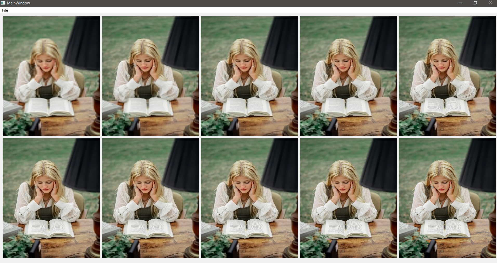
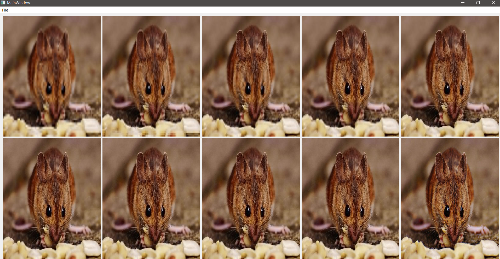

# Progressive-JPEG-Decompression

Jpeg compression is a direct application for Fourier transform as a sparse domain. we developed a decoder for Jpeg images where the user can browse for an image and display its decoding process progressively till it reaches the final image.

The app allows the user to read the image, decode it progressively as if the image data is fed to your program chunk by chunk, then display the output of 8-10 of these steps. starting from the one encoded by a very low amount of data to the one encoded with the full data.

